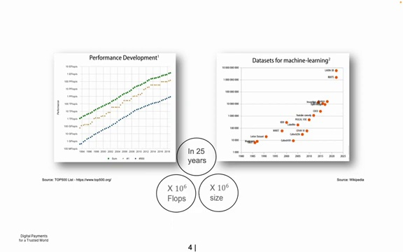

# [1) Introductory notes](https://www.youtube.com/watch?v=DeeL4sH9nvI&t=7s)


Yann-Aël Le Borgne, scientific collaborator at the Machine Learning Group at Université Libre de Bruxelles, presents an introduction to deep learning. 

The audience has varying levels of familiarity with neural networks, from perceptrons to more advanced architectures like convolutional neural networks and transformers.


<a href="https://www.youtube.com/watch?v=DeeL4sH9nvI&t=7s">Link to video</a>


The lecture aims to provide an overview of deep learning concepts without being redundant with the audience's existing knowledge.

# [2) Outline of the lecture](https://www.youtube.com/watch?v=DeeL4sH9nvI&t=55s)


Deep learning has become a trendy and highly useful field in the last decade, producing amazing results across various domains. However, it's important to put this progress into perspective by understanding the long history of research on neural networks that dates back to the 1950s.


## Perceptron and Multi-Layer Perceptron


The fundamental building blocks of neural networks are the perceptron and multi-layer perceptron (MLP) architectures. These classic models laid the groundwork for more advanced deep learning techniques.


<a href="https://www.youtube.com/watch?v=DeeL4sH9nvI&t=55s">Link to video</a>


## Transformer Networks


In recent years, transformer networks have emerged as a powerful architecture capable of analyzing not only text, but also images, sounds, and other types of variables. Some key aspects of transformers include:


- Self-attention mechanisms

- Ability to process sequential data

- Applicability across multiple modalities


## Training Data and Parallelization


The success of deep learning models heavily relies on the quality and quantity of training data. Techniques for parallelizing computation have also been crucial in enabling the training of large-scale models.


Additionally, various toolboxes and frameworks have been developed to facilitate the programming and deployment of neural networks.
# [3) Deep Learning vs Neural Networks: What Changed?](https://www.youtube.com/watch?v=DeeL4sH9nvI&t=142s)


Deep learning systems are neural networks (the terms are often used interchangeably), but what has changed over time?


<a href="https://www.youtube.com/watch?v=DeeL4sH9nvI&t=202s">Link to video</a>


The Google Trends chart above compares interest in "neural networks" (blue) vs "deep learning" (red) over time. Some key observations:


- Neural networks as a research area started declining in the early 2000s. Around 2004, working on neural nets was not seen as a promising path to publishable research. Other machine learning approaches like statistical methods, computational intelligence, and random forests were more in vogue.


- This continued until around 2010, when deep learning emerged as a rebranding of neural networks. 


- In 2012, deep learning started producing very useful results, causing the dramatic uptick in interest.


So what changed to make deep learning so much more effective compared to the neural networks of the past? A few key factors:


- **More data**: Since the 2000s, the growth of the internet and social networks has made huge amounts of data available that weren't accessible before. Neural networks need a lot of data to train on.


- **More computing power**: GPUs (graphics processing units) have enabled much faster computations. Originally designed for gaming in 2004 to rapidly perform mathematical operations on images (matrix multiplications), GPUs are perfectly suited for deep learning which relies heavily on matrix math. Using a GPU can speed up training by a factor of 30x compared to a CPU. 


- **Better software**: Deep learning libraries like TensorFlow, PyTorch and Keras have made it much easier to design and train neural networks with just a few lines of code. Previously, networks had to be programmed from scratch in C++ which was very time-consuming and difficult.


So while the core algorithms haven't changed much, the dramatic increase in data, computing power, and software tooling has enabled deep learning to become far more practical and powerful in recent years compared to the earlier era of neural networks research.
# [4) The Rise of Deep Learning in Image Classification](https://www.youtube.com/watch?v=DeeL4sH9nvI&t=406s)


In the early 2010s, deep learning techniques began to outperform traditional methods in image classification tasks. This was exemplified by the ImageNet Large Scale Visual Recognition Challenge (ILSVRC), a competition involving classifying 1 million images into 1,000 categories.


## ImageNet Performance Over Time


<a href="https://www.youtube.com/watch?v=DeeL4sH9nvI&t=526s">Link to video</a>


The graph above shows the performance of various techniques on the ImageNet challenge over time. In 2010 and 2011, the best accuracies were around 70% using methods like SVM or random forests. 


However, in 2012 there was a major breakthrough. A team achieved over 80% accuracy, a huge leap of 10 percentage points, by focusing their efforts on neural network architectures. This was a surprising and impressive result that had to be carefully verified.


The following year in 2013, nearly all teams switched to using deep learning approaches. This represented a seismic shift in the computer vision research community, with many researchers having to pivot from years of work on traditional methods to focus on deep learning.


## What Enabled the Rise of Deep Learning? 


Two key factors allowed deep learning to achieve such impressive results:


1. Increased computational power: Over a 25 year period from 2000 to 2025, the floating point operations per second (FLOPS) available increased by a factor of 1 million. 


2. Larger datasets: Dataset sizes grew exponentially over a 20 year period. Techniques like deep learning are able to effectively leverage large amounts of training data.




<a href="https://www.youtube.com/watch?v=DeeL4sH9nvI&t=646s">Link to video</a>


The combination of more powerful hardware and larger datasets allowed deep learning models with millions of parameters to be effectively trained, leading to their impressive performance on challenging benchmarks like ImageNet. This ushered in a new era of neural networks and deep learning dominating the field of computer vision.
# [5) Transformers and Recent Advances in AI](https://www.youtube.com/watch?v=DeeL4sH9nvI&t=656s)

## Landmark Achievements in AI since 2012


<a href="https://www.youtube.com/watch?v=DeeL4sH9nvI&t=1016s">Link to video</a>


Over the past decade, there have been several significant milestones in the field of artificial intelligence:


- 2012: AlexNet, a convolutional neural network, won the ImageNet competition and sparked renewed interest in deep learning.

- 2014: Generative Adversarial Networks (GANs) were introduced, enabling the creation of realistic generated images.

- 2016: AlphaGo, powered by convolutional neural networks, defeated the world champion in the complex game of Go.

- 2017: The Transformer architecture was introduced in the seminal "Attention is All You Need" paper.

- 2018: GPT (Generative Pre-trained Transformer) was released, marking the beginning of the GPT series of language models.

- 2020: GPT-3 and DALL-E demonstrated impressive capabilities in text and image generation, respectively.

- 2021: AlphaFold achieved remarkable success in predicting protein structures from amino acid sequences, a complex problem in biology with significant implications for medicine and disease understanding.


## The Exponential Growth of Language Models


Language models have experienced tremendous growth in terms of parameter count over the past few years:


- 2020: GPT-1 had around 100 million parameters

- 2022: GPT-3 had approximately 175 billion parameters

- 2023 (estimated): GPT-4 is believed to have close to 1 trillion parameters


This rapid increase in model size has led to significant improvements in performance and capabilities.


<a href="https://www.youtube.com/watch?v=DeeL4sH9nvI&t=1136s">Link to video</a>


The diagram above provides a more detailed look at the Transformer architecture, highlighting the attention mechanisms and feed-forward layers that enable these models to effectively process and generate sequential data.

# [6) Basic Computing Unit: The Perceptron](https://www.youtube.com/watch?v=DeeL4sH9nvI&t=1140s)


The most basic unit in a neural network is the perceptron, which is inspired by the biological neuron. A biological neuron receives information from inputs called dendrites, and if there is enough input, it discharges an electric signal into its axon, which can be represented as an output.


## Perceptron Model


A simplified representation of a biological neuron is the perceptron model:


- It has $s$ inputs, denoted as a vector $(x_1, x_2, ..., x_s)$

- It has $s$ weights $(w_1, w_2, ..., w_s)$ 

- The output is computed as the scalar product of the input $\mathbf{x}$ and weight $\mathbf{w}$ vectors

- An activation function $f$ is applied to the scalar product to determine the final output


<a href="https://www.youtube.com/watch?v=DeeL4sH9nvI&t=1260s">Link to video</a>


The simplest activation function is the unit step function, which outputs 1 if the scalar product is greater than 0, and 0 otherwise. This allows the perceptron to act as a linear separator.


## Activation Functions


While the unit step function is simple, differentiable activation functions are preferred for mathematical reasons, as they allow computation of derivatives to modify weights during training. Common differentiable activation functions include:


- Logistic function (tanh): Output ranges from -1 to 1

- Rectified Linear Unit (ReLU): $f(x) = \max(0, x)$


<a href="https://www.youtube.com/watch?v=DeeL4sH9nvI&t=1320s">Link to video</a>


ReLU is often preferred as its derivative is 1 for positive inputs, allowing for faster learning compared to logistic functions whose derivatives approach 0 away from 0.


## Training: Gradient Descent


To train a neural network, a training set $D_N$ of $N$ examples is used, where each example is an input-output pair $(x_i, y_i)$. A loss function $J(w, x, y)$, commonly squared loss, measures how well the algorithm predicts the output $y_i$ given input $x_i$.


The weights are updated via gradient descent to minimize the loss function:


<a href="https://www.youtube.com/watch?v=DeeL4sH9nvI&t=1500s">Link to video</a>


- Forward pass: Compute output for an input $x_i$

- Backward pass: Compute gradient $\nabla_w J(w, x_i, y_i)$ and update weights in the direction of the negative gradient

- Repeat for all examples in $D_N$

- The learning rate $\alpha$ controls the size of the weight updates


The choice of learning rate is important - too small and training is slow, too large and it becomes unstable. More advanced optimization techniques like Adam are commonly used to adaptively adjust the learning rate during training.
# [7) Multilayer Perceptron](https://www.youtube.com/watch?v=DeeL4sH9nvI&t=1618s)


A multilayer perceptron (MLP) is an extension of the basic perceptron model, allowing for more complex network architectures and improved learning capabilities.


## Fully Connected Layers


In an MLP, neurons are organized into multiple layers, with each neuron in one layer connected to all neurons in the adjacent layers. This architecture is known as a fully connected layer.


<a href="https://www.youtube.com/watch?v=DeeL4sH9nvI&t=1678s">Link to video</a>


The connections between layers are represented by weight matrices, where each element corresponds to the weight of the connection between two neurons. The output of each layer is computed by performing a matrix multiplication of the previous layer's outputs and the weight matrix, followed by the application of an activation function.


## Forward and Backward Pass


Training an MLP involves two main steps: the forward pass and the backward pass.


<a href="https://www.youtube.com/watch?v=DeeL4sH9nvI&t=1738s">Link to video</a>


- **Forward pass**: The input is propagated through the network, computing the outputs of each layer until the final output is obtained.

- **Backward pass**: The gradient of the loss function with respect to the weights is computed using backpropagation. The weights are then updated using an optimization algorithm, such as gradient descent, to minimize the loss.


The process is repeated for multiple iterations until the network converges to a satisfactory solution.


## Separating Complex Patterns


MLPs are capable of learning complex patterns and separating non-linearly separable classes. By combining multiple layers of neurons, an MLP can partition the input space into regions that correspond to different classes.


<a href="https://www.youtube.com/watch?v=DeeL4sH9nvI&t=1978s">Link to video</a>


In the example shown, a single hidden layer with three neurons is sufficient to separate the two classes. Each neuron in the hidden layer represents a plane in the input space, and the combination of these planes creates a decision boundary that separates the classes.


The activation function used in the hidden layer, such as the hyperbolic tangent (tanh), introduces non-linearity and allows for the formation of smooth decision boundaries.


## Conclusion


Multilayer perceptrons are powerful models that can learn complex patterns and solve non-linearly separable problems. By organizing neurons into multiple layers and using appropriate activation functions, MLPs can partition the input space and create decision boundaries that effectively separate different classes.
# [8) Deep Networks and Gradient Vanishing/Exploding Issues](https://www.youtube.com/watch?v=DeeL4sH9nvI&t=2015s)


Deep neural networks are powerful models that can learn complex representations from data. They consist of multiple layers of interconnected neurons, with weights between each layer that are trained using gradient descent.


<a href="https://www.youtube.com/watch?v=DeeL4sH9nvI&t=2255s">Link to video</a>


The key components of a deep network are:


- An input layer (X) 

- Layers of 'hidden' computing units ('neurons'), parameterised (W)

- Each layer computes $a^{(l)} = h^{(l)}(W^{(l-1)} a^{(l-1)})$

- An output layer (ŷ)

- Overall, ŷ=DNN(W,x)


## Gradient Vanishing/Exploding Issues


One challenge with training deep networks is the gradient vanishing/exploding issue. This arises from the chain rule used during backpropagation to compute gradients:


<a href="https://www.youtube.com/watch?v=DeeL4sH9nvI&t=2135s">Link to video</a>


The issue is caused by products of derivatives. RELU mitigates this effect since its derivative is 1 if its input is positive (but 0 if input negative - "dead neurons" issue).


Intuitively, as the number of layers increases, the gradients for weights in early layers can quickly vanish to near zero or explode to very large values. This makes it difficult to effectively train the weights in those layers.


## Generalizing Beyond Fully Connected Layers


While fully connected layers (dense layers) are commonly used, where each neuron is connected to all neurons in the previous layer, deep networks can generalize beyond this. 


The layers can apply other functions beyond matrix multiplication. For example, in image tasks, convolutional layers may apply filters to look for specific patterns like cats in a 2D input image.


So rather than always thinking of neural networks as neurons connected to all previous neurons, it's better to view the layers as applying some function with trainable weights to transform the input data to an output.


With the right architecture, activation functions, and training techniques, deep neural networks can learn powerful representations to solve complex tasks. But challenges like vanishing/exploding gradients require careful design.
# [9) Word Embeddings, Attention and Transformers](https://www.youtube.com/watch?v=DeeL4sH9nvI&t=2378s)


Word embeddings and attention are two important building blocks for Transformers, which can be applied to various types of data but were originally used for text processing.


<a href="https://www.youtube.com/watch?v=DeeL4sH9nvI&t=2378s">Link to video</a>


Word embeddings allow representing words as dense vectors in a high-dimensional space. This enables capturing semantic relationships between words - words with similar meanings will have vectors that are close together.


Attention is a mechanism that allows the model to focus on the most relevant parts of the input when generating each element of the output. It calculates a weighted sum of the input representations, where the weights indicate the importance of each input element.


Transformers combine these concepts of word embeddings and attention to process sequential data. The attention mechanism allows capturing long-range dependencies in the input sequence. Stacking multiple Transformer layers enables building powerful models for tasks like machine translation, text summarization, and language understanding.


By leveraging word embeddings to represent the input and attention to focus on the most relevant parts at each step, Transformers have achieved state-of-the-art performance on many natural language processing benchmarks. Their architecture is highly parallelizable, allowing efficient training on large datasets.
# [10) Word Embeddings](https://www.youtube.com/watch?v=DeeL4sH9nvI&t=2412s)


Word embeddings are a way to represent words as vectors of numbers in a high-dimensional space. This allows the computer to process and understand the semantic meaning of words.


## One-Hot Encoding


The most straightforward way to represent words as numbers is using one-hot encoding. In this approach, each word in the vocabulary is represented by a vector of size V (the vocabulary size). For a given word, the corresponding entry in the vector is set to 1, while all other entries are 0.


However, one-hot encoding has two main issues:

1. It does not capture any semantic information, as the encoding is arbitrary.

2. The vectors can become very large for high vocabulary sizes.


## Semantic Word Embeddings


Ideally, we want word embeddings where each dimension in the vector represents some semantic information. For example, consider a simplified world where everything can be represented by three dimensions: royalty, masculinity, and femininity.


<a href="https://www.youtube.com/watch?v=DeeL4sH9nvI&t=2642s">Link to video</a>


In this space, the word "king" could be represented by a vector with high values for royalty and masculinity, and a low value for femininity. Similarly, "queen" would have high values for royalty and femininity, and a low value for masculinity.


However, with just these three dimensions, we cannot distinguish between "queen" and "princess". By adding a fourth dimension for age, we can now represent these four concepts distinctly.


## Word Arithmetic


Once words are represented in a semantic embedding space, we can perform arithmetic operations on them. For example, if we subtract "man" from "king", we are left with the concept of "royalty". Adding "woman" to this "royalty" vector gives us "queen".


## Learning Word Embeddings


<a href="https://www.youtube.com/watch?v=DeeL4sH9nvI&t=2757s">Link to video</a>


Word embeddings are typically learned automatically from large corpora of text using neural networks. One popular approach is the skip-gram model, which consists of an input layer, a hidden layer, and an output layer.


The input layer uses one-hot encoding to represent the focus word. The output layer predicts the context words (the words surrounding the focus word). The hidden layer learns a compressed representation of the input, which becomes the word embedding.


For a vocabulary of 50,000 words, an embedding size of a few hundred dimensions is usually sufficient. The neural network is trained on a large text corpus, and the hidden layer weights converge to the semantic word embedding space.


## Visualizing Word Embeddings


Here is a demo showing word embeddings trained on a 300-dimensional space:


<a href="https://www.youtube.com/watch?v=DeeL4sH9nvI&t=3102s">Link to video</a>


We can see that the embeddings capture semantic relationships, such as gender (with words like "father", "uncle", "boy" on one side, and "daughter", "niece", "girl" on the other) and age.


The tutorial mentions that dimension 126 was found to be highly correlated with gender, with values around -0.03 for women and 0.03 for men.


We can also compute distances between word embeddings to find synonyms or measure the similarity between concepts. Clicking on a word in the demo shows its similarity to all other words.


Word embeddings provide a powerful way to represent and manipulate words based on their meanings, enabling more intelligent natural language processing applications.
# [11) Attention Mechanism in Transformers](https://www.youtube.com/watch?v=DeeL4sH9nvI&t=3563s)


The attention mechanism in Transformers allows words to communicate with one another and share information. Rather than just paying attention to other words in a sentence, words give information about themselves that may be useful for other words.


For example, consider the sentences:

1. The bank of the river.

2. Money in the bank.


<a href="https://www.youtube.com/watch?v=DeeL4sH9nvI&t=3727s">Link to video</a>


In the embedding space, the word "bank" would be positioned differently based on the context provided by the other words in the sentence. The attention mechanism allows "bank" to move closer to either "river" or "money" depending on the sentence.


<a href="https://www.youtube.com/watch?v=DeeL4sH9nvI&t=3891s">Link to video</a>


## Transformer Architecture


The main components of the Transformer architecture are:


1. Tokenization: The input sequence of words is transformed into tokens, which are intermediate representations. This helps reduce vocabulary size and capture semantics.


2. Embedding: Tokens are transformed into vector representations in a semantic space.


3. Positional Encoding: Information about the position of each token in the sequence is added.


4. Attention and Feed Forward Layers: The core of the Transformer consists of a sequence of blocks, each containing an attention layer and a feed forward layer.


<a href="https://www.youtube.com/watch?v=DeeL4sH9nvI&t=4219s">Link to video</a>


The attention layer allows words to communicate and share information, while the feed forward layer processes the information in a more abstract way. As you go deeper into the layers, the information becomes more abstract.


## Attention Computation


The attention computation can be thought of as a matrix operation:


```

Attention(X) = Softmax(Q * K^T) * V

```


Where:

- `X` is the input matrix of word embeddings

- `Q` (query), `K` (key), and `V` (value) are learned matrices that transform the input

- `*` denotes matrix multiplication

- `Softmax` is the softmax function that normalizes the attention weights


<a href="https://www.youtube.com/watch?v=DeeL4sH9nvI&t=5039s">Link to video</a>


The query matrix represents what each word would like to know about itself given the context. The key matrix represents what words can share about themselves, and the value matrix contains the actual information to be shared.


## Conclusion


The attention mechanism in Transformers allows for powerful communication between words in a sequence. By learning to share relevant information, Transformers can capture complex relationships and generate highly coherent output. The architecture, with its sequence of attention and feed forward layers, enables the model to process information at different levels of abstraction.
# [12) Vision Transformers (ViT)](https://www.youtube.com/watch?v=DeeL4sH9nvI&t=5205s)


Vision Transformers (ViT) are a type of deep learning architecture used for computer vision tasks. They utilize the Transformer architecture, which was originally developed for natural language processing, and adapt it for visual data.


<a href="https://www.youtube.com/watch?v=DeeL4sH9nvI&t=5205s">Link to video</a>


The key components of a Vision Transformer include:


- **Patch Embedding**: The input image is divided into patches, and each patch is linearly embedded.

- **Transformer Encoder**: The embedded patches are passed through a standard Transformer encoder, which includes Multi-Head Attention and Feed Forward layers.

- **Classification Head**: The output of the Transformer encoder is used for classification or other downstream tasks.


One advantage of Vision Transformers is their ability to capture global context and long-range dependencies in the image, thanks to the self-attention mechanism in the Transformer encoder.


# [13) Generative pretrained transformers](https://www.youtube.com/watch?v=DeeL4sH9nvI&t=5337s)


## Example of Training Mixtures


Different training mixtures can be used to train Transformers, depending on the specific task and dataset. Here's an example of various training mixtures and their proportions:


<a href="https://www.youtube.com/watch?v=DeeL4sH9nvI&t=5337s">Link to video</a>


The mixtures include datasets like OpenWebText, Wikipedia, and The Pile - Github. By combining different datasets and adjusting their proportions, the model can be trained to perform well on a variety of natural language processing tasks.


## GPT3: Datasets, Model Sizes, Training Times


GPT3 (Generative Pre-trained Transformer 3) is a large-scale language model developed by OpenAI. It has achieved impressive results on various natural language processing tasks. Here are some details about GPT3:


- It comes in different model sizes, ranging from 125 million to 175 billion parameters.

- The training data includes a massive corpus of web pages, books, and articles.

- Training GPT3 is computationally intensive, requiring thousands of GPU/TPU hours.


<a href="https://www.youtube.com/watch?v=DeeL4sH9nvI&t=5403s">Link to video</a>


The table above shows the different model sizes, number of parameters, and training times for GPT3. The largest model, GPT3 175B, has 175 billion parameters. 


## From GPT to InstructGPT (Reinforcement Learning with Human Feedback)


To create InstructGPT, a more aligned and instruction-following model, OpenAI employed a technique called Reinforcement Learning with Human Feedback (RLHF). The key steps in this process are:


1. **Supervised Fine-Tuning (SFT) Stage**: The base GPT model is fine-tuned on a dataset of high-quality instructions and corresponding outputs. This helps the model learn to follow instructions and generate appropriate responses.


2. **Reward Model (RM) Construction**: A reward model is trained to predict the quality and helpfulness of the model's outputs based on human preferences and ratings. This model is used to guide the reinforcement learning process.


3. **Reinforcement Learning (RL) Stage**: The fine-tuned model is further trained using reinforcement learning, where it receives rewards based on the reward model's predictions. This encourages the model to generate outputs that align with human preferences and instructions.


<a href="https://www.youtube.com/watch?v=DeeL4sH9nvI&t=5535s">Link to video</a>


By combining supervised fine-tuning and reinforcement learning with human feedback, InstructGPT is able to better understand and follow instructions while producing more coherent and helpful responses compared to the base GPT model.
# [14) Open Source Resources for AI Models](https://www.youtube.com/watch?v=DeeL4sH9nvI&t=5868s)


<a href="https://www.youtube.com/watch?v=DeeL4sH9nvI&t=5928s">Link to video</a>


Hugging Face is the reference website for finding open source AI models, datasets, and example code. Over the past year, there has been an explosion in the usage of the site, with the number of models increasing from around 40-50,000 to over 600,000 today.


## Navigating Hugging Face


The Hugging Face website allows you to search and filter through the vast collection of models. You can narrow down your search based on the type of learning architecture, such as natural language generation for models like ChatGPT. This can help reduce the number of potential models to consider.


<a href="https://www.youtube.com/watch?v=DeeL4sH9nvI&t=6048s">Link to video</a>


## Llama and the Importance of Model Size


Recently, Meta open-sourced the Llama model, which marks an important step in terms of model size. The number after a model name typically indicates the number of parameters. For example, an 8 billion parameter model requires around 16 GB of RAM to run (each parameter in the model is encoded with two bytes - as a 'float16'), which is within the capabilities of standard consumer GPUs. This makes these models accessible to a wider range of users.


## The Shift Towards Data-Centric AI


While model architecture and hyperparameters are important, the key factor driving advancements in AI systems today is the data used for training. What used to cost $100 million a year ago can now be done for a few hundreds of thousand dollars, thanks to the availability of large datasets. Improving these systems now heavily relies on curating and leveraging high-quality data.


## Transformers Library


Hugging Face developed the popular open source Transformers library that integrates with PyTorch and TensorFlow. It makes loading pre-trained models and fine-tuning them on your own data very straightforward.


Here's a simple code snippet to get started with a model:


```python
from transformers import pipeline
classifier = pipeline("sentiment-analysis")

result = classifier("This is a great movie!")
print(result)
```


## Spaces 


Hugging Face Spaces are interactive demos showcasing interesting applications built using their models and datasets. For example:


<a href="https://www.youtube.com/watch?v=DeeL4sH9nvI&t=6244s">Link to video</a>


# [15) Open and closed-soruce models](https://www.youtube.com/watch?v=DeeL4sH9nvI&t=6417s)


Large language models have seen a dramatic increase in size over recent years, as shown in this chart:


<a href="https://www.youtube.com/watch?v=DeeL4sH9nvI&t=6537s">Link to video</a>


The colors indicate which companies or organizations have developed these models. While some smaller models are open-source, the largest models tend to be developed by major tech companies who want to maintain the intellectual property. Meta has made efforts to open-source some of their models like the Llama series.


## Advantages and Disadvantages of Open vs Closed Models


Open-source and proprietary models each have benefits that should be carefully considered:


<a href="https://www.youtube.com/watch?v=DeeL4sH9nvI&t=6597s">Link to video</a>


Open models allow full control over the data and code, but require managing your own infrastructure which can be challenging to scale. Closed models handle the infrastructure for you, but limit your ability to customize.

# [16) Parallelism](https://www.youtube.com/watch?v=DeeL4sH9nvI&t=6657s)


## Parallelism Approaches for Training Large Models


Training the largest language models like GPT-3 on a single GPU would take hundreds of years. To make training feasible, computations need to be distributed across many GPUs. There are a few main approaches:


<a href="https://www.youtube.com/watch?v=DeeL4sH9nvI&t=6657s">Link to video</a>


- Data Parallelism: Split the training data across GPUs

- Tensor Parallelism: Divide large tensors/matrices across GPUs 

- Pipeline Parallelism: Process model layers sequentially across GPUs to optimize for network latency


# [17) Deep Learning Libraries: Keras and PyTorch](https://www.youtube.com/watch?v=DeeL4sH9nvI&t=6758s)

The two main deep learning frameworks are TensorFlow, originally from Google, and PyTorch, from Meta (Facebook). Historically TensorFlow was preferred for production deployments in industry while PyTorch was more common for research prototypes. 

However, PyTorch has improved its production capabilities and is seeing increasing adoption in industry as well as research. It provides a layer of abstraction over lower-level CUDA operations.


<a href="https://www.youtube.com/watch?v=DeeL4sH9nvI&t=6758s">Link to video</a>


## Getting Started


To get started with Keras or PyTorch, check out these resources:


<a href="https://www.youtube.com/watch?v=DeeL4sH9nvI&t=6878s">Link to video</a>


- [Keras getting started guide for engineers](https://keras.io/getting_started/intro_to_keras_for_engineers/)

- [PyTorch 60-minute blitz tutorial](https://pytorch.org/tutorials/beginner/deep_learning_60min_blitz.html)


Within an hour, you can have your first neural network trained and understand how the pieces fit together.


## Deep Learning: Limitations


While deep learning architectures are powerful, they do have some drawbacks:


<a href="https://www.youtube.com/watch?v=DeeL4sH9nvI&t=6938s">Link to video</a>


- Lack of theory in designing/training networks

  - Network structures are mostly empirical, trial and error

- Interpretability 

  - Hard to interpret how data is processed and what neurons do

- Computational resources, training times, cost, carbon footprint

  - Training large networks requires substantial computational resources


Deep learning is not always the best approach. For tasks like dealing with tabular data or time series, methods from statistics or other algorithms like gradient boosting or random forests may be more suitable.

## Additional references

- Online course: 
	- [MIT Introduction to deep learning - 2024](http://introtodeeplearning.com/)
	- [FastAI](https://www.fast.ai/) - Free online course - By Jeremy Howard
- Youtube channels: 
	- [Andrej Karpathy](https://www.youtube.com/@AndrejKarpathy), in particular [Intro to large language models](https://www.youtube.com/watch?v=zjkBMFhNj_g) 
	- [3Blue1Brown - What is a GPT?](https://www.youtube.com/watch?v=wjZofJX0v4M) - See also the whole series on Neural networks
- Book: [Dive into Deep Learning](https://d2l.ai/index.html), 2022  
